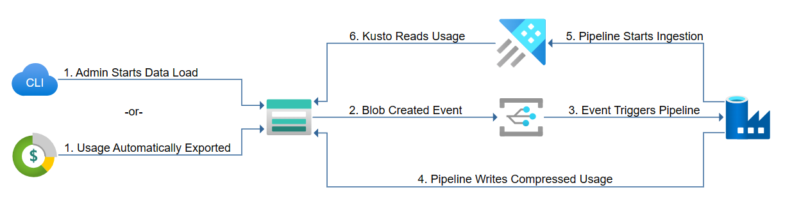
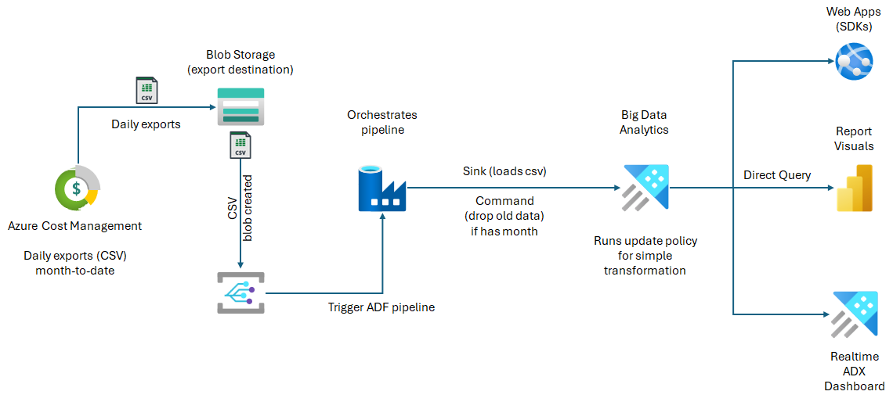

# Export Azure Cost Management to Kusto
Understanding your Azure Spend is one of the most important things you do as an Azure customer. 

**Azure Cost Management** is built into the platform to provide you insites. But we live in a world of data looking at the Azure Cost Management data in a silo may not meet your organizations needs. In those situations we can solve that need by putting your Cost Management data into an anlytical platform like **Azure Data Explorer** or **Microsoft Fabric KQL Database**. Here we can bring in or join additonal data that's useful, run ad-hoc queries and build visualization tying it all together.

In this repo, we'll show you how to utilize **Azure Cost Management** exports to setup an automated process that ingests the cost data into **ADX** or **Fabric KQL Database**.

## Architecture

The system consists of an Azure Data Explorer cluster, an Azure Data Factory instance, and a storage account. An admin using a command line tool or Azure Cost Management automatic export push usage data in to blob containers in the storage account. Azure Data Factory will automatically push new data in to Azure Data Explorer as it arrives in the blob containers.

## Flow

## Installation

There are two methods to deploy this architecture. 

1. Click to implement this using AzCLI (automatic):

2. Click to implement this using a guided-walkthrough (manual):

## Sample Results 

### Power BI Report
 
