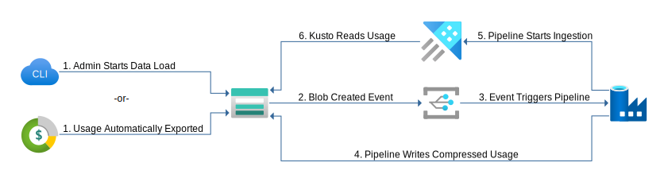

# ADX/Fabric KQL DB export from Azure Cost Management
Understanding your Azure Spend is one of the most important things you do as an Azure customer. Azure Cost Management is built into the platform to provide you insites. But we live in a world of data looking at the Azure Cost Management data in a silo may not meet your organizations needs. In those situations we can solve that need by putting your Cost Management Data into an anlytical platform like Azure Data Explorer or Fabric KQL Database. Here we can bring in whatever data is useful and run ad-hoc queries and build visualization that ties all that information together.

Hear we will show you how to utilize Azure Cost Management exports to setup an automated process that ingest the cost data into ADX or a Fabric KQL Datbase daily.

# Architecture

The system consists of an Azure Data Explorer cluster, an Azure Data Factory instance, and a storage account. An admin using a command line tool or Azure Cost Management automatic export push usage data in to blob containers in the storage account. Azure Data Factory will automatically push new data in to Azure Data Explorer as it arrives in the blob containers.

# Installation

There are two methods to deploy this architecture. To implement this method via automation

A walkthrough of setting this up manually is also provided   

